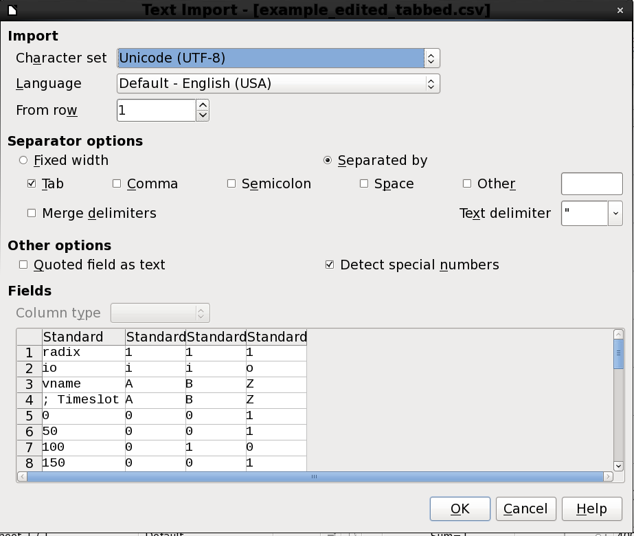
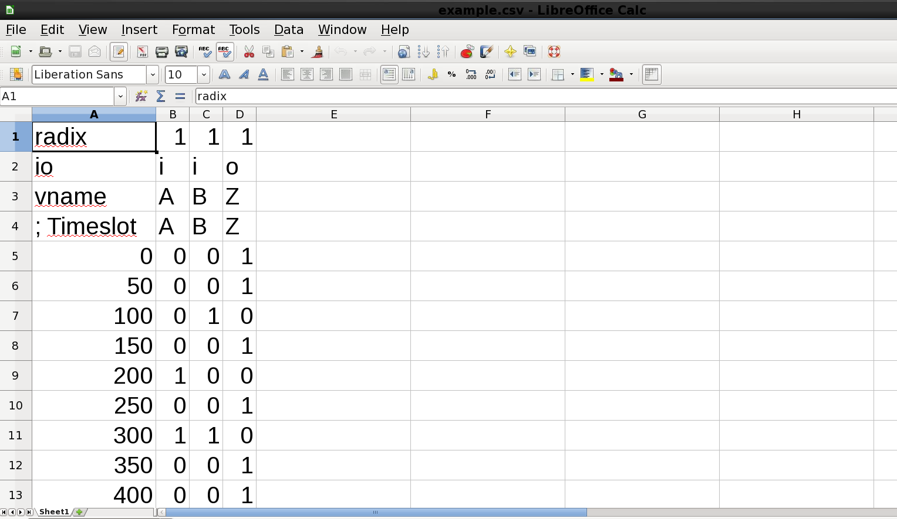
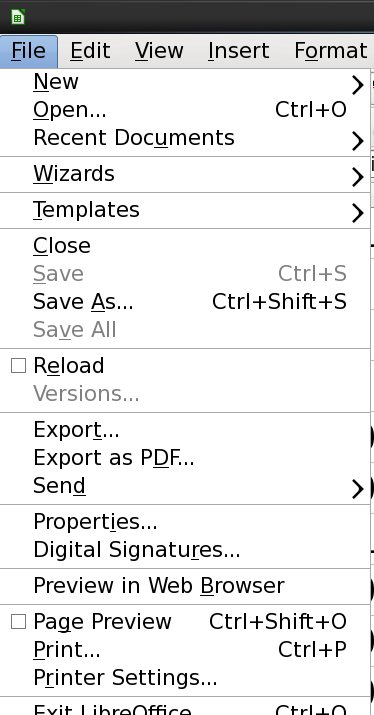
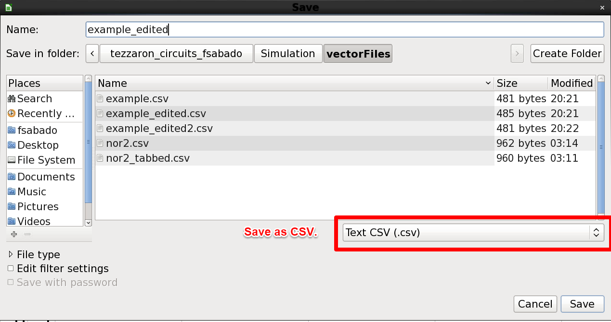

= Vector File Guide
//Header cannot contain spaces. Or it ends the header
:author: Francis Sabado
:email: fsabado@uark.edu
:orgname: University of Arkansas
//Set attributes on links
:linkattrs:
//These attributes are best defined inside the document.
//:description:
//:keywords:
//:revdate:
//:revremark:
//:revnumber:
//Formatting
:doctype: article
//Enable Experimental features
:experimental:
//Uncomment to embed images
//:data-uri:

//settings
include::_settings.adoc.txt[]

Document generated with Asciidoctor {asciidoctor-version}.

:toc: left

== Documentation:

/mscad/apps/Linux/cadence/IC615/doc/UltraSim_User/UltraSim_Chap13.html#52472

== Required Files

*Header File*:
`/home/fsabado/Tezzaron3D_project/tezzaron_circuits_fsabado/Simulation/vectorFiles/chrt130_vector_header.txt`

== Chartered 130nm Vector Header

[source, bash, linenums, nowrap]
.chrt130_vector_header.txt
----
include::./vectorFiles/chrt130_vector_header.txt[]
----

== Example CSV File(Tab Separated)
* This file is a tab separated file for input stimulus.

[source, bash, linenums, nowrap]
.example.csv
----
include::./vectorFiles/example.csv[]
----

== Making Data changes to the CSV

Start Libre Office
----
$ soffice
----

Open <filename>.csv

Example CSV: `/home/fsabado/Tezzaron3D_project/tezzaron_circuits_fsabado/Simulation/vectorFiles/example.csv`

== Vector Files Creation

Use the following settings.

Make desired changes

Save as CSV files without special formatting.

kbd:[Control] + kbd:[Shift] + kbd:[S]

Check that there are no special characters on the CSV file.
[source, bash, linenums, nowrap]
----
> cat example_edited.csv > cat example.csv
radix    1    1    1
io    i    i    o
vname    A    B    Z
; Timeslot    A    B    Z
0    0    0    1
50    0    0    1
100    0    1    0
150    0    0    1
200    1    0    0
250    0    0    1
300    1    1    0
350    0    0    1
400    0    0    1
450    0    0    1
500    0    0    1
550    0    0    1
600    0    0    1
650    0    0    1
700    0    0    1
750    0    0    1
800    0    0    1
850    0    0    1
900    0    0    1
950    0    0    1
1000    0    0    1
1050    0    0    1
1100    0    0    1
1150    0    0    1
1200    0    0    1
1250    0    0    1
1300    0    0    1
1350    0    0    1
1400    0    0    1
1450    0    0    1
1500    0    0    1
1550    0    0    1
1600    0    0    1
1650    0    0    1
1700    0    0    1
1750    0    0    1
1800    0    0    1
1850    0    0    1
1900    0    0    1
1950    0    0    1
2000    0    0    1
----

== Combine Header File and the Stimulus

*Usage*: +
----
cat [VectorHeader] [FormattedStimulus] > [OuputName].vec
----

*Example*: +
----
> cat chrt130_vector_header.txt example_edited.csv > example_edited.vec
----

Resulting Final vector file
[source, bash, linenums, nowrap]
.example_edited.vec
----
include::vectorFiles/example_edited.vec[]
----

== Vector File Compatibility

TIP: Vector Files are compatible with `spectre` and `ultrasim` simulations.

== Checking Vector File Checks

	* The vector check results logs are saved in `<SimulationDir>/<SchematicTBName>/<simulationName>/schematic/netlist`
	* For this guide, the results log was saved in: `/home/fsabado/Tezzaron3D_project/tezzaron_circuits_fsabado/SimResults/nor2_tb/spectre/schematic/netlist`
	* The filename for the log is `input_tran.veclog`

[example]
.input_tran.veclog
----
****VectorCheck for Z: All good!
    Number of total vector checks                = 40
    Number of X's matched correctly                = 0
    Number of Zero's matched correctly            = 3
    Number of One's matched correctly            = 37
    Number of total states matched correctly    = 40
    Number of total errors                        = 0
****VectorCheck for B: All good!
    Number of total vector checks                = 40
    Number of X's matched correctly                = 40
    Number of Zero's matched correctly            = 0
    Number of One's matched correctly            = 0
    Number of total states matched correctly    = 40
    Number of total errors                        = 0
****VectorCheck for A: All good!
    Number of total vector checks                = 40
    Number of X's matched correctly                = 40
    Number of Zero's matched correctly            = 0
    Number of One's matched correctly            = 0
    Number of total states matched correctly    = 40
    Number of total errors                        = 0
----

NOTE: Set `hlCheck` to 1 if you want to enable vector checks for the inputs.

=== Reusing Vector File

* Create Multiple input vector files.
* Check `Simulation` folder for different input vectors.

=== Tips in Generating Z

* Use OpenOffice function.
* You can implement function (A + B + C) or any function on OpenOffice
* This simplifies generation of output Z.

== Known Problems and Solution
=== CSV File contains hidden special characters after editing CSV
==== Solution
* Install `gedit-plugins`. +
Install on CentOS: `sudo yum apt-get install gedit-plugins`
* Enabled `Draw Spaces` plugin using `Preferences Tab`
* Open on `gedit`, and then remove the special characters.

=== Vector Check does not recognize analog signals
==== Solution: Analog Signal vs Digital Signal Comparison
* Use `avoh` option on the vector header.
* Use `avol` option on the vector header.

=== Open Office Autocapitalize
* Go to `Tools` -> `AutoCorrect Options` -> `Options Tab`
* Uncheck `Capitalize first letter of every sentence`
